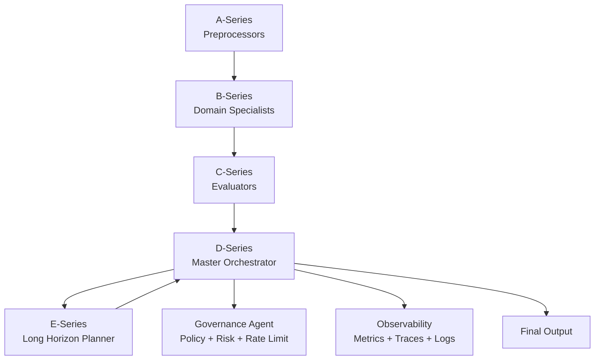

# 📘 MetaCore v7.0 – Capstone Roadmap
## Executive Summary

### Revenant MetaCore is a self-governing, self-correcting, multi-series AI Agent Mesh engineered for resilience, autonomy, and system-level reasoning.The Capstone Edition (v7.0) delivers a simplified yet powerful workflow suitable for Google’s AI Agents Intensive competition.

# 📌 Phase Breakdown
## 🔵 Phase 0 — Eligibility & Infrastructure (Day 1–2)

    1.Set up Kaggle notebook environment

    2.Create GitHub repo for public review

    3.Add minimal runnable version of MetaCore

    4.Prepare agents directory and orchestration engine

    5.Build metrics logger + trace visualizer

# 🟣 Phase 1 — Architecture Upgrade (Day 3–6)
    1.✔ Add E-Series (Extended Intelligence Layer)

    2.Memory Graph

    3.Long-Horizon Planner

    4.Meta-State Aggregator

    5.✔ Integrate n8n Workflow Layer

    6.Convert workflow v4.4.2 to Capstone-friendly JSON

    7.Add governance nodes

    8.Add resilience nodes

    9.Add error recovery nodes

    10.✔ Strengthen D-Series (Master Orchestrator)

    11.Fully stable node execution

    12.Node parallelization

    13.Governance hooks

    13.Audit logging

    14.Condition routing

    15.Self-healing loops

## 🟡 Phase 2 — Capstone MVP (Day 5–10)

### Demo Workflow Title:

#### 🔥 “A Self-Healing Multi-Agent System with Governance, Recovery, and Dynamic Routing.”
##### Workflow Structure:

    A-Series: Input prep

    B-Series: Domain agents

    C-Series: Evaluators

    D-Series: Orchestrator

    E-Series: Long-horizon reasoning

    Governance hooks

    Final output

##### Deliverables:

    Captured metrics

    Logs

    Audit trail

    Flow diagram

## 🟠 Phase 3 — Polish for Judges (Day 10–12)

    Architecture diagram

    System overview

    Why it matters

    Real-world value

    Perfect README

    Screenshots + demo

## 🔴 Phase 4 — Submit (Day 12–14)

    Publish Kaggle Notebook

    Push repo to public

    Submit to Capstone portal

    Attach README, diagrams, workflow

# Diagram of the MetaCore Architecture

# 📌 Future Extensions

    F-Series: Autonomous tooling

    L-Series: LLM integration

    Z-Series: Zero-shot robotics